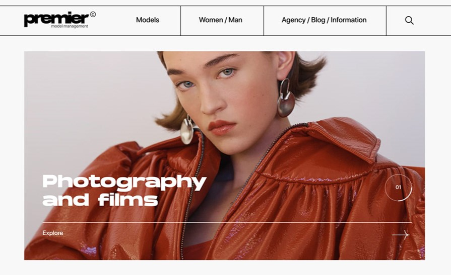

# Premier Models Website

A modern, responsive website project for Premier Models, showcasing fashion photography and model portfolios with interactive elements and animations.

## Features

- Responsive design for various screen sizes
- Custom preloader animation
- Horizontal image slider for model portfolios
- Alphabetical navigation for model search
- Multiple content sections (featured photoshoots, updates, blog posts)
- Animated marquee text
- GSAP animations for smooth scrolling effects
- Circular text animation

## Technologies Used

- HTML5
- CSS3
- JavaScript
- GSAP
- ScrollTrigger